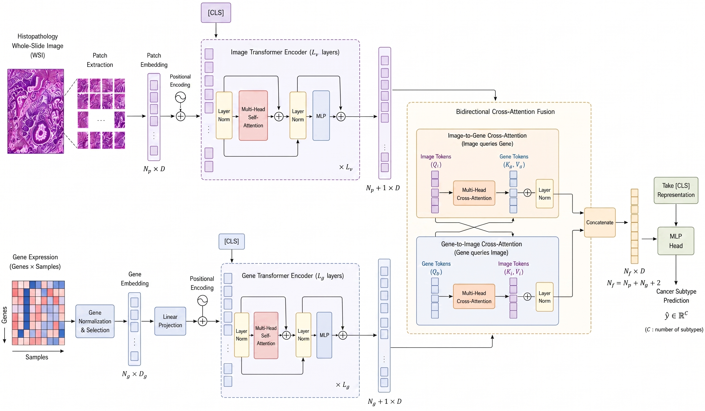

# PathGenFusion

**Explainable Multimodal Breast Cancer Subtype Classification via Bidirectional Histopathology-Transcriptome Attention**

---

## Overview

PathGenFusion is a multimodal deep learning framework that jointly classifies breast cancer molecular subtypes from histopathological whole-slide images (WSIs) and bulk RNA-seq gene expression profiles. The core contribution is a bidirectional cross-modal attention mechanism that lets image patch tokens query the gene representation (V2G) and the gene token query all image patches (G2V), enabling explicit inter-modality interaction rather than simple feature concatenation.

**Task:** Binary classification — Luminal (LumA + LumB) vs. Non-Luminal (Basal + HER2-enriched)

**Dataset:** TCGA-BRCA matched cohort, 93 patients (63 Luminal, 30 Non-Luminal)

---

## Results (5-fold stratified cross-validation)

| Fold | F1 | MCC | PR-AUC |
|------|----|-----|--------|
| 1 | 1.0000 | 1.0000 | 1.0000 |
| 2 | 0.9231 | 0.8895 | 0.9062 |
| 3 | 0.8000 | 0.7161 | 0.9742 |
| 4 | 0.9231 | 0.8864 | 1.0000 |
| 5 | 0.9231 | 0.8864 | 1.0000 |
| **Mean** | **0.9138 ± 0.0642** | **0.8757 ± 0.0909** | **0.9761 ± 0.0364** |

---

## Architecture



The framework consists of four components:

1. **Vision Branch** — ResNet50 (ImageNet, frozen) extracts 2048-dim features per patch; 2 Transformer Encoder Blocks with 8-head MHSA model patch-to-patch dependencies
2. **Gene Branch** — Dense(512, GELU) + BatchNorm + Dropout projects 20,318-gene RNA-seq profiles to a single 512-dim token
3. **Bidirectional Cross-Modal Attention** — V2G and G2V attention streams with shared projection dimension d = 512
4. **Classification Head** — Global Average Pooling + concat (1024-dim) → MLP → sigmoid

---

## Dataset

- **TCGA-BRCA** via the GDC Data Portal: https://portal.gdc.cancer.gov/
- **Preprocessed dataset** (gene expression, pre-processed histopathological images, metadata): https://figshare.com/articles/dataset/The_attached_file_contains_Gene_expression_data_pre-processed_histopathological_images_and_metadata_for_breast_cancer_patients_/28050083

---

## Installation

```bash
git clone https://github.com/<your-username>/PathGenFusion.git
cd PathGenFusion
pip install -r requirements.txt
```

Python 3.10+ is recommended. A GPU with CUDA support is required for practical training times.

---

## Usage

### Notebook

[](https://colab.research.google.com/drive/1a8O3rPzxw31s0JjBe4XxyhNm02RWTGLW?usp=sharing)

Or open `notebooks/PathGenFusion.ipynb` locally.

### Script

```python
from src.train import main

main(
    gex_file="path/to/gene_expression.csv",
    metadata_file="path/to/TCGA-BRCA-A2-target_variable.xlsx",
    image_dir="path/to/BLOCKS_NORM_MACENKO",
    epochs=35,
    batch_size=8,
    n_splits=5,
)
```

### Module-level usage

```python
from src.preprocessing import preprocess_metadata, preprocess_images, filter_data
from src.model import build_transformer_model
from src.xai import MultimodalExplainer

model = build_transformer_model(gene_dims=20318)
explainer = MultimodalExplainer(model, gene_feature_names)
ig = explainer.integrated_gradients([vision_input, gene_input])
```

---

## Repository Structure

```
PathGenFusion/
├── README.md
├── LICENSE
├── requirements.txt
├── .gitignore
├── src/
│   ├── __init__.py
│   ├── preprocessing.py     # Data loading, WSI tiling, GEX normalization, feature extraction
│   ├── model.py             # Transformer encoder, bidirectional cross-modal attention, full model
│   ├── train.py             # Training loop, LR scheduler, plotting, main()
│   └── xai.py               # Integrated Gradients, Permutation Importance, GradCAM, attention viz
├── notebooks/
│   └── PathGenFusion.ipynb  # Full end-to-end Colab notebook
└── figures/
    ├── architecture.png     # Model architecture diagram
    ├── data_pipeline.png    # Data preprocessing pipeline
    ├── attention_heads.png  # Vision self-attention head heatmaps
    └── patch_importance.png # WSI patches ranked by G2V attention score
```

---

## Explainability

Three post-hoc explanation methods are applied to the best model:

- **Integrated Gradients** — path-integrated attribution scores per gene feature, identifying expression patterns that most influence each prediction
- **Permutation Importance** — accuracy drop when individual gene columns are shuffled (evaluated on a 200-gene random subset)
- **Attention Output Visualization** — hidden-state outputs of V2G and G2V cross-attention layers showing patch-level and gene-level response patterns

---

## Citation

If you use this code or the preprocessed dataset, please cite:

```bibtex
@article{alvi2025pathgenfusion,
  title={PathGenFusion: Explainable Multimodal Breast Cancer Subtype Classification
         via Bidirectional Histopathology-Transcriptome Attention},
  year={2025},
  url={https://github.com/alvi-uiu/PathGenFusion}
}
```

---

## License

This project is licensed under the terms in the [LICENSE](LICENSE) file.
